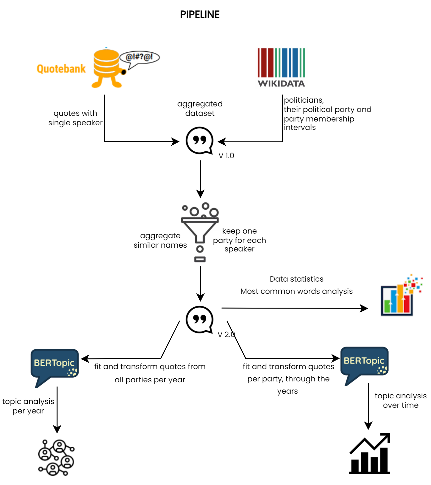
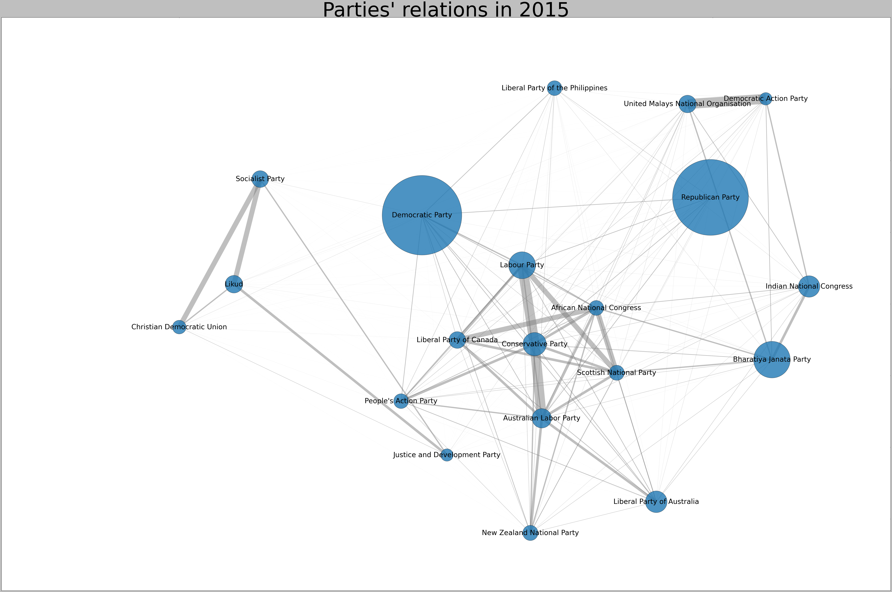
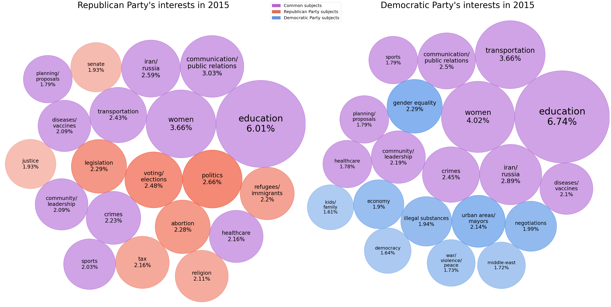
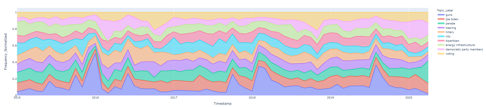
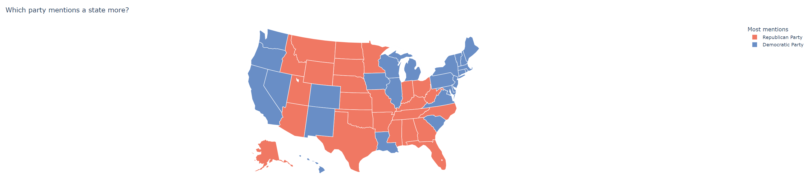
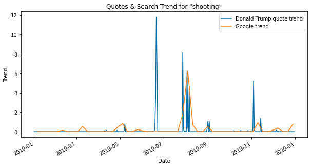

# What Do Parties Talk About? Political Parties' Interests Seen Through Quotes

## Data Story :book:

🌍 [arinaraileanu.github.io/What-Do-Parties-Talk-About](https://arinaraileanu.github.io/What-Do-Parties-Talk-About/)

## Abstract :memo:
<!---
A 150 word description of the project idea and goals. What’s the motivation behind your project? What story would you like to tell, and why?)
--->
The Quotebank dataset provides 178 million quotes gathered from English news articles published throughout the years. We aim to assess whether there is a link between the main topics addressed by political figures and their corresponding parties. If a link is found, it could be an additional datapoint for voters to evaluate a party, which is why we consider this research to be relevant. For the purpose of our analysis, we use a sequence of filters on Quotebank (to get only politicians) and get more insights about politicians using Wikidata. Besides data statistics and speakers’ words analysis we employ two BERTopic models to develop a topic analysis per year and a topic analysis over time.

 poya lui Mihai cu schema
  

## Research Questions :grey_question:
<!---
A list of research questions you would like to address during the project.
--->
Using our current and future analysis, we answered a sequence of questions and gained insights into the relationship between the most common topics addressed in quotes and the parties their speakers belong to:
1. Can politicians' quotes be clustered by subject?
1. What are the most common subjects tackled by politicians? 
1. Do the main subjects change with time?

## Additional Datasets :fax:
<!---
List the additional dataset(s) you want to use (if any), and some ideas on how you expect to get, manage, process, and enrich it/them.
Show us that you’ve read the docs and some examples, and that you have a clear idea on what to expect. Discuss data size and format if relevant.
It is your responsibility to check that what you propose is feasible.
--->
Given that we are interested in the political orientation of our speakers, we decided to enrich our data with the additional metadata about the
speakers, provided through the `speaker_attributes.parquet` file. 
1. We first have to map the Q-code attributes to their corresponding labels. Initially, we attempted to use the [Wikidata API](https://qwikidata.readthedocs.io/en/stable/readme.html) to aggregate all the aliases and the label for each Q-code.
However, this procedure was slow, so we later decided to use the provided `wikidata_labels_descriptions_quotebank.csv.bz2`
file for the mapping.
1. We filter the Wikidata entries to keep only the Q-codes of the speakers with politician as one of their occupations and who belong to at least one party.
1. We inner join the Quotebank and the Wikidata entries based on the speaker's Q-codes, such that every row would now contain additional labelled information
about the speaker. This results in a dataframe only containing politician quotes. 
1. If a `qid` field in Quotebank does not match with any of the `id` values in Wikidata, we have observed that this happens because the Quotebank
Q-code is not the most recent one. We simply drop all these rows, as they do not have a correspondence in Wikidata.
1. To attribute a party to a quote, we engineered a dataset where we map each unique speaker Q-code to a list of tuples - `<party_name>, <start_date>, <end_date>`. We are retrieving the dates using Wikidata's `qwikidata` API.
1. If a speaker belonged to only one political party throughout their life, we associate that party with their quotes, regardless of the date.
1. If a speaker belonged to multiple parties, we aim to select the party they were part of at the time of the quotation.

## Methods :mag:
For the current stage of the project, we decided to analyze data from 2018. In our final analysis, we will include data for all the available years. Our research goals are all politically-related. Thus, we use the subset of quotes belonging to politicians, extracted with the methods described above
in the [additional datasets section](#additional-datasets). 

To ensure a higher confidence in our analysis, we filtered out rows where the probability of the speaker is lower than 0.6. Furthermore, we remove all the rows which have multiple Q-codes associated to their speaker, as it is difficult to distinguish who actually uttered the quote.

> ### Can politicians' quotes be clustered by subject?
To investigate this, we create sentence embeddings using the BERTopic. We used two models:
- Fit and transform quotes from all parties per year to vizualise the topic analysis per year

  
  

- Fit and transform quotes per party thorugh the years to vizualise topic analysis over time

  

We further explored the most common words as entities and parts of speach for the two most quoted parties - Republican and Democratic. Moreover, we predicted the US elections results in each state based on the state mentions by each party members.

  

> ### What are the most common subjects tackled by politicians? 
As a crude example, we can investigate the occurrences of the topic word in the quotations by a politician. We pre-process the data using NLTK to identify commonly used nouns within speaker quotations. As an example, we empirically observe differences between nouns for Trump and Obama, which are discussed in the notebook. The table below represents the 10 most common nouns of each speaker.

<table class="tg">
<thead>
  <tr>
    <th class="tg-0pky">Donald Trump</th>
    <th class="tg-0pky">Barack Obama</th>
  </tr>
</thead>
<tbody>
  <tr>
    <td class="tg-0pky">people</td>
    <td class="tg-0pky">people</td>
  </tr>
  <tr>
    <td class="tg-0pky">country</td>
    <td class="tg-0pky">time</td>
  </tr>
  <tr>
    <td class="tg-0pky">president</td>
    <td class="tg-0pky">president</td>
  </tr>
  <tr>
    <td class="tg-0pky">time</td>
    <td class="tg-0pky">world</td>
  </tr>
  <tr>
    <td class="tg-0pky">Trump</td>
    <td class="tg-0pky">country</td>
  </tr>
  <tr>
    <td class="tg-0pky">states</td>
    <td class="tg-0pky">politics</td>
  </tr>
  <tr>
    <td class="tg-0pky">lot</td>
    <td class="tg-0pky">years</td>
  </tr>
  <tr>
    <td class="tg-0pky">deal</td>
    <td class="tg-0pky">democracy</td>
  </tr>
  <tr>
    <td class="tg-0pky">world</td>
    <td class="tg-0pky">things</td>
  </tr>
  <tr>
    <td class="tg-0pky">things</td>
    <td class="tg-0pky">work</td>
  </tr>
</tbody>
</table>

Using the initial results of the first question, we conduct additional analysis on the quotes contained within topic clusters. We keep track of the political party of the members within each topic cluster and output the number of quotes each party is associated with for a given cluster.

> ### Do the main subjects change with time?
Not only do politicians switch parties from time to time, but even opinions within the same party can fluctuate. Our first approach at monitoring quote trends involves counting the quotes containing a certain keyword by date and relating them to Google trends, to figure out whether they follow a similar pattern. The plot below suggests a link between the occurrence of "shooting" in Donald Trump's quotes and the search trend of the word. Furthermore, both can be related to mass shootings that happened in the US, such as the El Paso shooting, which corresponds to the highest spike in both trends.

 

                                                                    
While examining approaches for answering our third research question, we discovered an important aspect of the dataset. Quotes may be referenced in news websites at a different time than originally spoken. Furthermore, news quotes may not be a direct representation of what politicians actually talk about. By definition, quotes are cherry-picked by authors that might be biased. For example, some websites are owned by politicians and controversial subjects are over-emphasised in the media.

<!---
> Can website biases influence our findings on the actual subjects politicians talk about?

Some subjects that may be important for a party are not highlighted in the media. 

(or synonyms of the word) 

 Initially, the analysis can be based on a list of pre-defined topics which we deem relevant to the speaker or party. We can implement an end-to-end approach by using the results of the sentence classifier in the first question to create a dynamic list of topics to look for.

* feasibility of the clusters 
* scaling the current analysis to multiple years
-->  
                                                                    

## Proposed timeline :clock10:
* 15.11.21 Integration of datasets for all years into current analysis.
* 19.11.21 Re-do clustering based on topics of interests.
* 22.11.21 Pause project work.
* 26.11.21 **Homework 2 deadline**
* 28.11.21 Perform final analyses.
* 08.12.21 Begin developing a rough draft of the datastory.
* 11.12.21 Complete all code implementations and visualisations relevant to analysis.
* 14.12.21 Complete datastory.
* 17.12.21 **Milestone 3 deadline**

## Team Organization :raised_hands:
<!---
A list of internal milestones up until project Milestone 3.
--->
<table class="tg" style="undefined;table-layout: fixed; width: 342px">
<colgroup>
<col style="width: 164px">
<col style="width: 178px">
</colgroup>
<thead>
  <tr>
    <th class="tg-0lax"></th>
    <th class="tg-0lax">Tasks</th>
  </tr>
</thead>
<tbody>
  <tr>
    <td class="tg-0lax">@arinaraileanu</td>
    <td class="tg-0lax">Come up with meaningful visualizations  Continue exploring the dataset  Develop the final text for the data story</td>
  </tr>
  <tr>
    <td class="tg-0lax">@nitu-catalin1998</td>
    <td class="tg-0lax">Develop the web interface  Analyze news website bias  Develop the final text for the data story</td>
  </tr>
  <tr>
    <td class="tg-0lax">@MihaiDavid05</td>
    <td class="tg-0lax">Define topic of interests  Tune clustering  Develop the final text for the data story</td>
  </tr>
  <tr>
    <td class="tg-0lax">@umerhasan17</td>
    <td class="tg-0lax">Develop the web interface  Integrate datasets of all years  Develop the final text for the data story</td>
  </tr>
</tbody>
</table>
