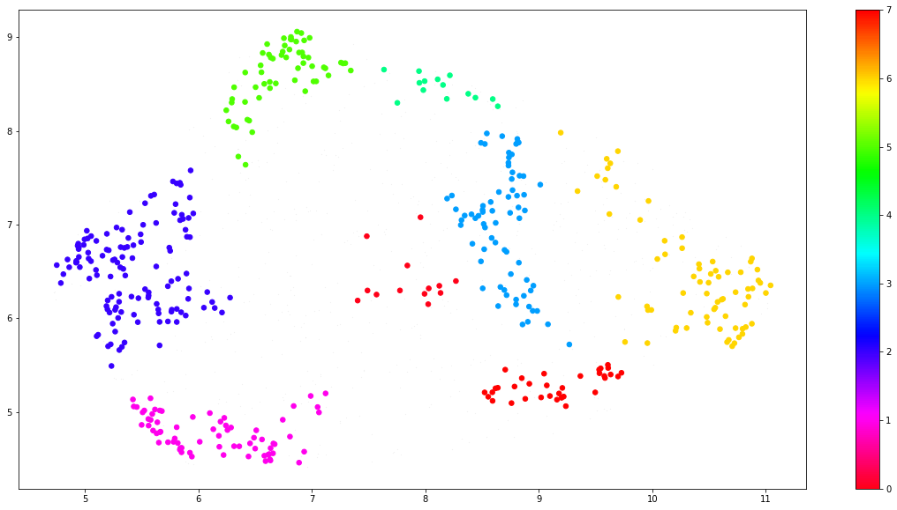

# [TODO COOL TITLE ABOUT PARTIES & OPINIONS]

## Abstract :memo:
<!---
A 150 word description of the project idea and goals. What’s the motivation behind your project? What story would you like to tell, and why?)
--->
## Research Questions :grey_question:
<!---
A list of research questions you would like to address during the project.
--->
Using our current and future analysis, we aim to answer a sequence of questions to gain an insight into our final hypothesis.
1. Can politicians' quotes be clustered by subject?
1. What are the most common subjects tackled by politicians? 
1. Do the main subjects change with time?

**Hypothesis: Is there a link between the most common subjects per speaker and their political orientation and/or party membership?**

## Additional Datasets :fax:

<!---
List the additional dataset(s) you want to use (if any), and some ideas on how you expect to get, manage, process, and enrich it/them.
Show us that you’ve read the docs and some examples, and that you have a clear idea on what to expect. Discuss data size and format if relevant.
It is your responsibility to check that what you propose is feasible.
--->
Given that we are interested in the political orientation of our speakers, we decided to enrich our data with the additional metadata about the
speakers, provided through the `speaker_attributes.parquet` file. 
1. We first have to map the Q-code attributes to their corresponding labels. Initially, we attempted to use the [Wikidata API](https://qwikidata.readthedocs.io/en/stable/readme.html) to aggregate all the aliases and the label for each Q-code.
However, this procedure was slow, so we later decided to use the provided `wikidata_labels_descriptions_quotebank.csv.bz2`
file for the mapping.
1. We filter the Wikidata entries to keep only the Q-codes of the speakers with politician as one of their occupations.
1. We inner join the Quotebank and the Wikidata entries based on the speaker's Q-codes, such that every row would now contain additional labelled information
about the speaker. This results in a dataframe only containing politician quotes. 
1. If a `qid` field in Quotebank does not match with any of the `id` values in Wikidata, we have observered that this happens because the Quotebank
Q-code is not the most recent one. We simply drop all these rows, as they do not have a correspondence in Wikidata.

## Methods :mag:

For the current stage of the project, we decided to analyze data from 2018. In our final analysis, we will include data for all the available years. Our research goals are all politically-related. Thus, we primarily use the subset of quotes belonging to politicians, extracted with the methods described above
in the [additional datasets section](#additional-datasets). 

To ensure a higher confidence in our analysis, we filtered out rows where the probability of the speaker is lower than 0.6. Furthermore, we remove all the rows which have multiple Q-codes associated to their speaker, as it is difficult to distinguish who actually uttered the quote.

> ### Can politicians' quotes be clustered by subject?
We create sentence embeddings using the BERT sentence transformer. Thus, the sentences are mapped to a 768 dimensional vector space. Afterwards, we use UMAP for dimensionality reduction. The reduced vectors are passed to HDBSCAN to segment quotes within clusters. We chose to investigate the number of neighbours in umap (`n_neighbours`), the number of dimensions to use in the reduced sentence embeddings (`n_components`), and the minimum cluster size (`min_cluster_size`) for segmenting the data. We treated these values as hyperparameters in the clustering model.

> ### What are the most common subjects tackled by politicians? 
As a crude example, we can investigate the occurrences of the topic word in the quotations by a politician. We pre-process the data using NLTK to identify commonly used nouns within speaker quotations. As an example, we empirically observe differences between nouns for Trump and Obama, which are discussed in the notebook. The table below represents the 10 most common nouns of each speaker.

| Donald Trump | Barack Obama |
|--------------|--------------|
| people       | people       |
| country      | time         |
| president    | president    |
| time         | world        |
| Trump        | country      |
| states       | politics     |
| lot          | years        |
| deal         | democracy    |
| world        | things       |
| things       | work         |

Using the initial results of the first question, we conduct additional analysis on the quotes contained within topic clusters. We keep track of the political party of the members within each topic cluster and output the number of quotes each party is associated with for a given topic. For the future milestone, we will refine our analyses based on the labelled topic clusters.

> ### Do the main subjects change with time?
Not only do politicians switch parties from time to time, but even opinions within the same party can fluctuate. Our first approach at monitoring quote trends involves counting the quotes containing a certain keyword by date and relating them to Google trends, to figure out whether they follow a similar pattern. While investigating approaches for answering our 3rd research question, we discovered an important aspect of the dataset. There is no feasible way to link the original time of the quote to the time it is referenced in a website. 

We consider that the quotes in quotebank may not be a direct representation of what politicians actually talk about. By definition, quotes are cherry picked by authors that might be biased. For example, some websites are owned by politicians and controversial subjects are over-emphasised in the media.

<!---
> Can website biases influence our findings on the actual subjects politicians talk about?

Some subjects that may be important for a party are not highlighted in the media. 

(or synonyms of the word) 

 Initially, the analysis can be based on a list of pre-defined topics which we deem relevant to the speaker or party. We can implement an end-to-end approach by using the results of the sentence classifier in the first question to create a dynamic list of topics to look for.

-->

These websites may promote or downplay controversial subjects or highlight negatives of other parties.

The media tends to overemphasise controversial subjects    

 in our methods (lag between quote and website reference of quote). Added complexity if politician is in multiple parties. To simplify this, we make an assumption. 

Methods for scaling analysis to multiple years:

Given the limited in-memor

* feasibility of the clusters 
* scaling the current analysis to multiple years

## Proposed timeline :clock10:
* 15.11.21 Integration of additional datasets into current analysis
* 19.11.21 Begin on a comprehensive analysis targetting each individual research question
* 22.11.21 Pause project work 
* 26.11.21 **Homework 2 deadline**
* 28.11.21 Finish comprehensive analysis and link relevant insights to final hypothesis.
* 08.12.21 Reach conclusion on final hypothesis and begin on a rough draft of the datastory.
* 11.12.21 Complete all code implementations and visualisations relevant to analysis
* 14.12.21 Complete datastory 
* 17.12.21 **Milestone 3 deadline**

## Team Organization :raised_hands:
<!---
A list of internal milestones up until project Milestone 3.
--->

## Questions for TAs
<!---
Add here any questions you have for us related to the proposed project.
--->
